# 🍵  Crowdfunding Platform


---

## 📖 About The Project

**Buy Me a Chai ☕** is a modern crowdfunding platform designed for creators, developers, and artists.  
Fans can **directly support their favorite creators** by buying them a virtual cup of chai. ✨  

Built with **Next.js, TailwindCSS, MongoDB, NextAuth, and Razorpay**, the platform ensures seamless **authentication, donations, and profile management**.

---

## ✨ Key Features

- 🔑 **Authentication (NextAuth)** – Login with Google & GitHub securely.
- 💳 **Payments (Razorpay)** – Simple and secure transactions.
- 🖼️ **Custom Profiles** – Avatars, cover images, and creator descriptions.
- 📊 **Dashboard** – Manage your donations and supporters in one place.
- 📜 **Donation History** – Track who supported you and how much.
- ⚡ **Fast & Scalable** – Powered by Next.js & MongoDB.

---

## 📸 Screenshots

### Landing Page


### Login Page


### Personal Information Page


### Creator Page


### Donation Page


### Payment Page


### Your Donations Page


---

## 📁 Directory Structure

The project is organized as follows:

```
Directory structure:
└── buy-me-a-chai/
    ├── README.md
    ├── jsconfig.json
    ├── LICENSE
    ├── next.config.mjs
    ├── package.json
    ├── postcss.config.mjs
    ├── tailwind.config.js
    ├── .eslintrc.json
    ├── actions/
    │   └── userAction.js
    ├── app/
    │   ├── globals.css
    │   ├── layout.js
    │   ├── not-found.js
    │   ├── page.js
    │   ├── [username]/
    │   │   └── page.js
    │   ├── about/
    │   │   └── page.js
    │   ├── api/
    │   │   ├── auth/
    │   │   │   └── [...nextauth]/
    │   │   │       └── route.js
    │   │   └── razorpay/
    │   │       └── route.js
    │   ├── dashboard/
    │   │   └── page.js
    │   ├── donations/
    │   │   └── page.js
    │   └── login/
    │       └── page.js
    ├── components/
    │   ├── Button.js
    │   ├── Coin.js
    │   ├── Footer.js
    │   ├── Group.js
    │   ├── Help.js
    │   ├── Man.js
    │   ├── Navbar.js
    │   ├── PaymentPage.js
    │   ├── SessionWrapper.js
    │   └── Tea.js
    ├── db/
    │   └── connectDB.js
    └── models/
        ├── Payment.model.js
        └── User.model.js

```
### Key Folders and Files:

- **/components**: Contains reusable UI components like Navbar, Footer, PaymentPage, and buttons.
- **/app**: Main application routes and pages (Next.js App Router). Includes profile pages, dashboard, donations, login, and API routes.
- **/app/api**: Server-side route handlers for **authentication (NextAuth)** and **payment processing (Razorpay)**.
- **/actions**: Contains server actions like user handling and custom logic.
- **/db**: MongoDB connection setup.
- **/models**: Database models for users and payments (Mongoose schemas).
- **/styles (globals.css)**: TailwindCSS global styling and theme setup.

---
## 🏗️ Architecture

This document illustrates the **high-level architecture** of the **Buy Me A Chai**.  
It shows how **users**, **creators**, **frontend**, **backend**, and **services** interact with each other.


- **Frontend (Next.js + TailwindCSS):** Renders the dashboard, editor, and presentation views. Handles client-side logic and state with **State Management**.
- **Backend (Next.js API Routes):** Handles dynamic users,donations and data persistence.
- **Database (Mongoose + MongoDB):** Stores user accounts, donations, creators, and history.
- **Authentication (OAuth):** Provides secure user login and session management.
- **Payments (RazorPay):** Handles subscriptions and monetization for creators.

```mermaid
graph TD
    %% ==============================
    %% CLIENT LAYER
    %% ==============================
    subgraph Client
    U[🙋 User] --> F[💻 Next.js Frontend]
    C[🎨 Creator ] --> F
    end

    %% ==============================
    %% FRONTEND TO BACKEND
    %% ==============================
    F -->|🔑 Login / Signup| Auth[🔐 NextAuth]
    F -->|📝 Create Profile / Update Info| API[⚙️ API Routes]
    F -->|💰 Make Donation| Pay[💳 Razorpay]
    F -->|📊 View Dashboard| API

    %% ==============================
    %% BACKEND LAYER
    %% ==============================
    subgraph Backend
    API --> DB[(🗄️ MongoDB + 🛠️ Mongoose)]
    API --> Sec[✅ Payment Verification Logic]
    end

    %% ==============================
    %% SERVICES LAYER
    %% ==============================
    subgraph Services
    Auth --> Oauth[🌐 Google / GitHub OAuth]
    Pay --> Bank[(🏦 Banking / Razorpay Gateway)]
    end

    %% ==============================
    %% DATA FLOWS
    %% ==============================
    U -->|🌍 Access Website| F
    C -->|⚙️ Setup Profile| F
    Auth -->|🔑 Session Token| F
    Pay -->|📩 Payment Status| API
    API -->|📦 Store Donations & Users| DB
    Sec -->|🔒 Validated Transaction| DB

    %% ==============================
    %% COLORS
    %% ==============================
    style U fill:#f9f,stroke:#333,stroke-width:2px
    style C fill:#ffb347,stroke:#333,stroke-width:2px
    style F fill:#87CEEB,stroke:#333,stroke-width:2px
    style Auth fill:#ff6666,stroke:#333,stroke-width:2px
    style API fill:#ffd700,stroke:#333,stroke-width:2px
    style Pay fill:#32CD32,stroke:#333,stroke-width:2px
    style DB fill:#90EE90,stroke:#333,stroke-width:2px
    style Sec fill:#ffa07a,stroke:#333,stroke-width:2px
    style Oauth fill:#1e90ff,stroke:#333,stroke-width:2px
    style Bank fill:#c0c0c0,stroke:#333,stroke-width:2px
```



---

## 🛠 Built With

- **Frontend:** Next.js 15, TypeScript, TailwindCSS
- **Backend:** MongoDB
- **Auth:** OAuth
- **Payments:** RazorPay
  
---

## ⚙️ Getting Started

### Prerequisites

- Node.js 18+
- MongoDB instance
- Razorpay API Keys
- Google/GitHub OAuth Keys

### Installation

```bash
git clone https://github.com/username/be-a-guptaji-buy-me-a-chai.git
cd be-a-guptaji-buy-me-a-chai
npm install
```

### Configuration

Create `.env.local` and add:

```env
MONGODB_URI=your_mongo_url
NEXTAUTH_SECRET=your_secret
NEXTAUTH_URL=http://localhost:3000
GITHUB_ID=your_github_id
GITHUB_SECRET=your_github_secret
GOOGLE_ID=your_google_id
GOOGLE_SECRET=your_google_secret
RAZORPAY_KEY_ID=your_razorpay_id
RAZORPAY_KEY_SECRET=your_razorpay_secret
```

### Run Development Server

```bash
npm run dev
```

Visit 👉 [http://localhost:3000](http://localhost:3000)

---

## 🛣️ Roadmap

- [x] User Authentication (Google/GitHub)
- [x] Razorpay Integration
- [x] Profile Management
- [x] Dashboard for Donations
- [ ] Email Notifications
- [ ] Export Donation Reports
- [ ] Multi-language Support

---

## 📜 License

MIT License © 2025 Aryan Baadlas

---

## 📬 Contact

👨‍💻 **Aryan Baadlas**  
📧 **aryanbaadlas@gmail.com**

---

### ⭐ Show some love!

If you like this project, **give it a star ⭐ on GitHub**!
